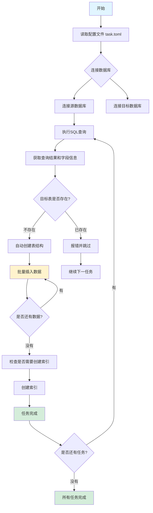

# db-ferry 数据迁移工具使用手册

## 什么是 db-ferry?

db-ferry 是一个数据搬运工具,它可以帮助你把数据从一个数据库迁移到另一个数据库。就像一个"数据渡轮",把数据从"A码头"运送到"B码头"。

### 它能做什么?

- 支持 Oracle、MySQL 和 SQLite 三种数据库之间的数据迁移
- 自动创建目标表结构(无需手动建表)
- 支持批量数据迁移,效率高
- 提供进度条,实时查看迁移状态
- 迁移完成后自动创建索引,加快查询速度

### 适合谁用?

- 数据分析师:需要将生产库数据导入本地分析
- 开发人员:需要在不同环境同步数据
- 业务人员:需要定期备份或迁移业务数据

---

## 快速开始

### 第一步:准备配置文件

db-ferry 使用一个名为 `task.toml` 的配置文件来告诉你想从哪里迁移到哪里。

创建一个文本文件,命名为 `task.toml`,然后用记事本编辑它。

### 第二步:填写数据库连接信息

在配置文件中,你需要先定义数据库连接。就像告诉工具"A码头"和"B码头"在哪里。

#### 示例1:连接 MySQL 数据库

```toml
[[databases]]
name = "我的MySQL数据库"      # 给这个连接起个名字,方便后面引用
host = "192.168.1.100"       # 数据库服务器IP地址
type = "mysql"                # 数据库类型
port = "3306"                 # 端口号(默认3306)
database = "business_db"      # 数据库名称
user = "dbuser"               # 用户名
password = "your_password"    # 密码
```

#### 示例2:连接 Oracle 数据库

```toml
[[databases]]
name = "公司Oracle数据库"
type = "oracle"
host = "oracle.company.com"
port = "1521"                 # Oracle默认端口
service = "ORCLPDB1"          # Oracle服务名
user = "hr"
password = "hr_password"
```

#### 示例3:SQLite 数据库(本地文件)

SQLite 是一个文件型数据库,不需要账号密码,只需要指定文件路径。

```toml
[[databases]]
name = "本地数据文件"
type = "sqlite"
path = "./mydata.db"          # 数据库文件路径(可以是相对或绝对路径)
```

#### 示例4:同时定义多个数据库

你可以在一个配置文件中定义多个数据库连接:

```toml
# 生产环境MySQL数据库
[[databases]]
name = "生产数据库"
type = "mysql"
host = "prod.company.com"
port = "3306"
database = "production"
user = "readonly"
password = "readonly_pass"

# 本地分析数据库(本地文件)
[[databases]]
name = "本地分析库"
type = "sqlite"
path = "./analysis_data.db"

# 测试环境MySQL
[[databases]]
name = "测试数据库"
type = "mysql"
host = "test.company.com"
port = "3306"
database = "test_db"
user = "test_user"
password = "test_pass"
```

### 第三步:定义迁移任务

告诉工具具体迁移哪些数据。每个任务包括:
- 从哪里取数据(源数据库)
- 取什么数据(SQL查询)
- 放到哪里(目标数据库)
- 存成什么表名

#### 示例5:简单全表迁移

```toml
[[tasks]]
table_name = "员工表"         # 目标表名
sql = "SELECT * FROM employees"  # 从源数据库查询所有员工数据
source_db = "生产数据库"       # 源数据库(使用上面定义的名字)
target_db = "本地分析库"       # 目标数据库
ignore = false                  # false表示执行此任务,true表示暂时不执行
```

#### 示例6:只迁移部分字段

如果只想要某些字段:

```toml
[[tasks]]
table_name = "员工基本信息"
sql = """
SELECT
    employee_id,    -- 员工编号
    first_name,     -- 名字
    last_name,      -- 姓氏
    email,          -- 邮箱
    department_id   -- 部门编号
FROM employees
"""
source_db = "生产数据库"
target_db = "本地分析库"
ignore = false
```

#### 示例7:带条件过滤

只迁移符合某些条件的数据:

```toml
[[tasks]]
table_name = "销售数据_2024"
sql = """
SELECT
    order_id,
    customer_name,
    order_date,
    total_amount
FROM sales_orders
WHERE order_date >= '2024-01-01'  -- 只迁移2024年的数据
    AND total_amount > 1000       -- 只迁移金额大于1000的订单
"""
source_db = "生产数据库"
target_db = "本地分析库"
ignore = false
```

#### 示例8:复杂业务查询

可以使用 JOIN 等复杂SQL:

```toml
[[tasks]]
table_name = "完整订单信息"
sql = """
SELECT
    o.order_id,
    o.order_date,
    c.customer_name,
    p.product_name,
    o.quantity,
    o.unit_price,
    (o.quantity * o.unit_price) as total_price
FROM orders o
JOIN customers c ON o.customer_id = c.customer_id
JOIN products p ON o.product_id = p.product_id
WHERE o.order_status = '已完成'
"""
source_db = "生产数据库"
target_db = "本地分析库"
ignore = false
```

### 第四步:添加索引(可选)

迁移完成后,可以自动创建索引来加快查询速度。

#### 示例9:单列索引

```toml
[[tasks]]
table_name = "员工表"
sql = "SELECT * FROM employees"
source_db = "生产数据库"
target_db = "本地分析库"
ignore = false

[[tasks.indexes]]               # 为上面的任务创建索引
name = "idx_员工编号"            # 索引名称
columns = ["employee_id"]       # 索引字段
unique = false                  # 是否唯一索引
```

#### 示例10:多列组合索引

```toml
[[tasks]]
table_name = "员工表"
sql = "SELECT * FROM employees"
source_db = "生产数据库"
target_db = "本地分析库"
ignore = false

[[tasks.indexes]]
name = "idx_部门员工姓名"
columns = ["department_id", "last_name", "first_name"]
unique = false
```

#### 示例11:带排序的索引

可以指定索引的排序方式(升序ASC或降序DESC):

```toml
[[tasks]]
table_name = "销售订单"
sql = "SELECT * FROM sales_orders"
source_db = "生产数据库"
target_db = "本地分析库"
ignore = false

[[tasks.indexes]]
name = "idx_订单日期"
columns = ["order_date:DESC"]   # 按订单日期降序排列
unique = false
```

在创建表后,在指定列上建立名为 `idx_订单日期` 的索引,并按 `订单日期` 降序排列,以提高查询效率。

#### 示例12:唯一索引

如果某列或某几列的值必须唯一:

```toml
[[tasks]]
table_name = "用户表"
sql = "SELECT user_id, email, username FROM users"
source_db = "生产数据库"
target_db = "本地分析库"
ignore = false

[[tasks.indexes]]
name = "idx_邮箱唯一"
columns = ["email"]
unique = true                   # 唯一索引,email不能重复
```

#### 示例13:为SQLite创建部分索引(条件索引)

只在满足某些条件的行上创建索引(仅SQLite支持):

```toml
[[tasks]]
table_name = "订单表"
sql = "SELECT * FROM orders"
source_db = "生产数据库"
target_db = "本地分析库"  # 目标必须是SQLite
ignore = false

[[tasks.indexes]]
name = "idx_大额订单"
columns = ["order_id"]
unique = false
where = "total_amount > 10000"  # 只对金额大于10000的订单创建索引
```

### 第五步:执行迁移

打开终端(命令行工具),进入db-ferry所在的目录:

```bash
# 基本用法(使用当前目录下的task.toml)
./db-ferry

# 如果配置文件在其他位置
./db-ferry -config /path/to/your/task.toml

# 查看详细日志(调试时使用)
./db-ferry -v

# 查看版本
./db-ferry -version
```

---

## 完整配置示例

### 场景1:从生产库同步数据到本地分析库

```toml
# ============= 数据库定义 =============

# 生产环境MySQL
[[databases]]
name = "生产数据库"
type = "mysql"
host = "prod-db.company.com"
port = "3306"
database = "business_db"
user = "readonly"
password = "readonly_password"

# 本地SQLite分析库
[[databases]]
name = "本地分析库"
type = "sqlite"
path = "./business_analysis.db"

# ============= 迁移任务 =============

# 迁移客户信息
[[tasks]]
table_name = "客户资料"
sql = """
SELECT
    customer_id,
    customer_name,
    email,
    phone,
    registration_date,
    customer_level
FROM customers
WHERE status = '活跃'
"""
source_db = "生产数据库"
target_db = "本地分析库"
ignore = false

[[tasks.indexes]]
name = "idx_客户ID"
columns = ["customer_id"]
unique = true

[[tasks.indexes]]
name = "idx_客户等级"
columns = ["customer_level"]
unique = false

# 迁移订单信息(最近一年)
[[tasks]]
table_name = "订单数据_2024"
sql = """
SELECT
    order_id,
    customer_id,
    order_date,
    total_amount,
    payment_method,
    order_status
FROM orders
WHERE order_date >= DATE_SUB(CURDATE(), INTERVAL 1 YEAR)
"""
source_db = "生产数据库"
target_db = "本地分析库"
ignore = false

[[tasks.indexes]]
name = "idx_订单客户"
columns = ["customer_id"]
unique = false

[[tasks.indexes]]
name = "idx_订单日期"
columns = ["order_date:DESC"]
unique = false

# 迁移产品信息
[[tasks]]
table_name = "产品目录"
sql = "SELECT * FROM products"
source_db = "生产数据库"
target_db = "本地分析库"
ignore = false

[[tasks.indexes]]
name = "idx_产品编号"
columns = ["product_id"]
unique = true
```

### 场景2:多数据库汇总到数据仓库

```toml
# ============= 数据库定义 =============

# 销售系统数据库
[[databases]]
name = "销售系统"
type = "mysql"
host = "sales.company.com"
database = "sales_db"
user = "dw_reader"
password = "dw_pass"

# 库存系统数据库
[[databases]]
name = "库存系统"
type = "oracle"
host = "inventory.company.com"
service = "INVDB"
user = "dw_reader"
password = "dw_pass"

# 数据仓库
[[databases]]
name = "数据仓库"
type = "mysql"
host = "dw.company.com"
database = "data_warehouse"
user = "dw_writer"
password = "dw_write_pass"

# ============= 迁移任务 =============

# 从销售系统同步订单
[[tasks]]
table_name = "fact_orders"
sql = """
SELECT
    order_id,
    customer_id,
    product_id,
    order_date,
    quantity,
    unit_price,
    (quantity * unit_price) as revenue
FROM sales_orders
WHERE order_status = '已完成'
"""
source_db = "销售系统"
target_db = "数据仓库"
ignore = false

# 从库存系统同步库存数据
[[tasks]]
table_name = "fact_inventory"
sql = """
SELECT
    product_id,
    warehouse_id,
    inventory_date,
    quantity_on_hand,
    quantity_reserved,
    (quantity_on_hand - quantity_reserved) as available_quantity
FROM inventory_snapshot
"""
source_db = "库存系统"
target_db = "数据仓库"
ignore = false

[[tasks.indexes]]
name = "idx_库存产品日期"
columns = ["product_id", "inventory_date:DESC"]
unique = false
```

### 场景3:分批次迁移大表

对于特别大的表,可以拆分成多个任务:

```toml
# ============= 数据库定义 =============

[[databases]]
name = "历史数据库"
type = "mysql"
host = "archive.company.com"
database = "archive"
user = "archive_reader"
password = "archive_pass"

[[databases]]
name = "本地历史备份"
type = "sqlite"
path = "./historical_data.db"

# ============= 迁移任务 =============

# 迁移2023年数据
[[tasks]]
table_name = "日志数据_2023"
sql = """
SELECT * FROM user_logs
WHERE log_date >= '2023-01-01'
    AND log_date < '2024-01-01'
"""
source_db = "历史数据库"
target_db = "本地历史备份"
ignore = false

# 迁移2022年数据
[[tasks]]
table_name = "日志数据_2022"
sql = """
SELECT * FROM user_logs
WHERE log_date >= '2022-01-01'
    AND log_date < '2023-01-01'
"""
source_db = "历史数据库"
target_db = "本地历史备份"
ignore = false

# 迁移2021年数据
[[tasks]]
table_name = "日志数据_2021"
sql = """
SELECT * FROM user_logs
WHERE log_date >= '2021-01-01'
    AND log_date < '2022-01-01'
"""
source_db = "历史数据库"
target_db = "本地历史备份"
ignore = false

# 为每个表创建索引
[[tasks]]
table_name = "日志数据_2023"
[[tasks.indexes]]
name = "idx_2023_日志日期"
columns = ["log_date:DESC"]
unique = false

[[tasks]]
table_name = "日志数据_2022"
[[tasks.indexes]]
name = "idx_2022_日志日期"
columns = ["log_date:DESC"]
unique = false

[[tasks]]
table_name = "日志数据_2021"
[[tasks.indexes]]
name = "idx_2021_日志日期"
columns = ["log_date:DESC"]
unique = false
```

---

## 数据类型映射说明

工具会自动识别源数据的类型,并在目标数据库中创建合适的字段类型:

| 源数据类型 | 目标数据类型 | 说明 |
|-----------|-------------|------|
| 整数(1, 2, 3...) | INTEGER | 存储整数 |
| 小数(3.14, 99.99) | REAL | 存储小数 |
| 文本(abc, 你好) | TEXT | 存储文字 |
| 日期(2024-01-01) | TEXT | 存储为文本格式 |
| 二进制(图片、文件) | BLOB | 存储二进制数据 |

---

## 常见问题

### Q1: 密码在配置文件中明文保存,安全吗?

A: 配置文件只在你的电脑上使用,不会被上传到任何地方。确保配置文件不被他人访问即可。为了更安全,可以:
- 设置配置文件权限: `chmod 600 task.toml`
- 将配置文件放在安全的目录中

### Q2: 迁移中断后,可以重新开始吗?

A: 可以。db-ferry会自动创建新表,如果表已存在会报错。如果想重新迁移:
1. 删除目标数据库中的表
2. 重新运行 db-ferry

### Q3: 如何只迁移部分数据?

A: 在SQL中使用WHERE条件筛选:
```sql
SELECT * FROM orders WHERE order_date >= '2024-01-01'
```

### Q4: 迁移速度如何?

A: db-ferry使用批量插入,每批1000条数据。速度取决于:
- 网络速度(远程数据库)
- 数据量大小
- 目标数据库性能

### Q5: 如何临时跳过某个任务?

A: 将该任务的 `ignore` 设置为 `true`:
```toml
[[tasks]]
ignore = true  # 暂时不执行此任务
```

---

## 数据链路流程图

下面的流程图展示了数据如何从源数据库迁移到目标数据库:



### 流程说明

1. **读取配置**: 工具首先读取 `task.toml` 配置文件,获取数据库连接信息和迁移任务

2. **连接数据库**: 根据配置连接源数据库和目标数据库

3. **执行查询**: 在源数据库上执行你在配置文件中写的SQL查询

4. **获取数据结构**: 工具自动分析查询结果的字段名、数据类型等信息

5. **创建目标表**:
   - 如果目标表不存在,自动创建
   - 如果已存在,报错并跳过此任务

6. **批量插入数据**:
   - 每次插入1000行数据
   - 显示进度条,实时查看迁移进度

7. **创建索引**: 如果配置文件中指定了索引,在数据迁移完成后创建

8. **完成任务**: 所有任务完成后,显示成功信息

---

## 使用技巧

### 技巧1:先测试小数据量

首次使用时,建议先用少量数据测试:

```toml
[[tasks]]
table_name = "测试表"
sql = "SELECT * FROM large_table LIMIT 1000"  -- 只取1000条测试
source_db = "生产数据库"
target_db = "本地分析库"
ignore = false
```

确认无误后,再移除 `LIMIT` 进行完整迁移。

### 技巧2:分批迁移大表

对于几百万行的大表,建议按时间或ID范围分批:

```toml
# 第一批:ID 1-1000000
[[tasks]]
table_name = "用户数据_第一批"
sql = "SELECT * FROM users WHERE id <= 1000000"
...

# 第二批:ID 1000001-2000000
[[tasks]]
table_name = "用户数据_第二批"
sql = "SELECT * FROM users WHERE id > 1000000 AND id <= 2000000"
...
```

### 技巧3:使用视图简化复杂查询

如果SQL很复杂,可以在源数据库创建视图,然后迁移视图:

```toml
[[tasks]]
table_name = "汇总数据"
sql = "SELECT * FROM summary_view"  -- 视图名
...
```

### 技巧4:合理安排任务顺序

有依赖关系的表按顺序迁移:

```toml
# 先迁移主表(如客户表)
[[tasks]]
table_name = "客户表"
sql = "SELECT * FROM customers"
...

# 再迁移从表(如订单表)
[[tasks]]
table_name = "订单表"
sql = """
SELECT o.* FROM orders o
JOIN customers c ON o.customer_id = c.customer_id
"""
...
```

---

## 故障排查

### 问题1:无法连接数据库

**现象**: 提示连接错误

**检查**:
1. 确认数据库地址、端口、用户名、密码正确
2. 确认数据库服务正在运行
3. 确认网络可达(可以尝试ping)
4. 检查防火墙设置

### 问题2:权限不足

**现象**: 提示权限错误

**解决**:
- 源数据库:需要SELECT权限
- 目标数据库:需要CREATE TABLE、INSERT、CREATE INDEX权限

### 问题3:表已存在

**现象**: 提示表已存在错误

**解决**:
1. 删除目标数据库中的表
2. 或修改 `table_name` 使用新表名

### 问题4:数据类型不支持

**现象**: 某些字段迁移后数据异常

**解决**:
在SQL中转换数据类型:
```sql
SELECT
    CAST(字段 AS CHAR) as 新字段名
FROM table
```

### 问题5:迁移时间过长

**解决**:
1. 检查网络速度
2. 分批迁移
3. 关闭不必要的索引(迁移完成后再创建)
4. 在目标数据库所在服务器上运行db-ferry

---

## 总结

db-ferry 是一个简单易用的数据迁移工具,核心优势:

✓ **配置简单**: 一个配置文件搞定所有设置
✓ **自动建表**: 无需手动创建表结构
✓ **批量高效**: 每批1000条,迁移速度快
✓ **进度可见**: 实时进度条,一目了然
✓ **灵活筛选**: 支持复杂SQL查询和条件过滤
✓ **索引管理**: 迁移后自动创建索引

### 最佳实践

1. **先测试,后生产**: 先用测试数据验证配置
2. **分批进行**: 大表分批迁移,降低风险
3. **监控进度**: 关注进度条和日志输出
4. **验证结果**: 迁移后抽样检查数据完整性
5. **备份重要数据**: 迁移前备份目标数据库

---

## 技术支持

如有问题,请:
1. 查看 `task.toml` 配置文件是否正确
2. 检查数据库连接信息
3. 查看详细日志: `./db-ferry -v`
4. 参考本文档的故障排查章节
5. 检查源数据SQL是否正确(可在数据库客户端测试)

---

**版权声明**: 本工具仅供合法数据迁移使用,请遵守相关数据安全规定。
